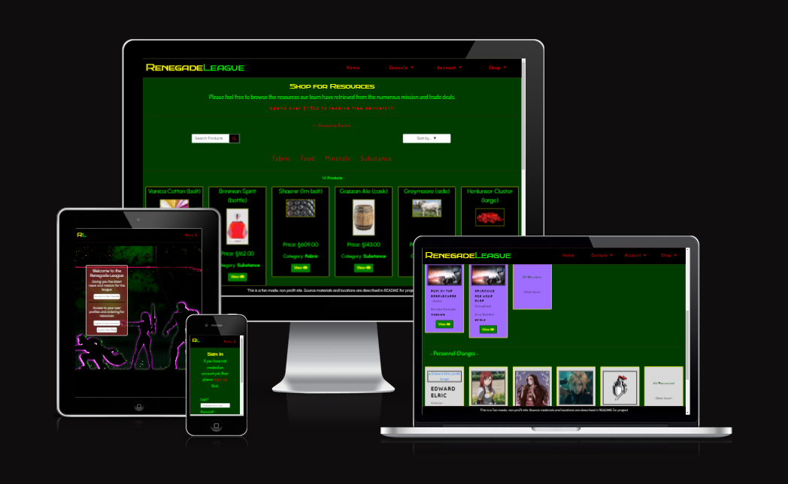

# Fantasy Blog Shop

## # Table of Contents

1. [Link to Live Site](#link-to-live-site)
2. [LucidCHART ERD Diagram](#ludic-chart-erd-diagram)
3. [Wireframes](#link-to-live-site)
4. [Overview](#link-to-live-site)
5. [User Stories](#user-stories)
6. [Features](#features)
    1. [Index Page](#index-page)
    2. [Console Page](#console-page)
    3. [All News/Missions/Personnel Page](#all-news-mission-personnel-page)
    4. [News Page](#news-page)
    5. [Missions Page](#missions-page)
    6. [Personnel Page](#personnel-page)
    7. [Account Login](#account-login)
    8. [Account Signup](#account-signup)
    9. [Account Logout](#account-logout)
    10. [Resources Page](#resources-page)
    11. [Resource Details Page](#resources-details-page)
    12. [Shopping Basket Page](#shopping-basket-page)
    13. [Checkout Page](#checkout-page)
    14. [Checkout Success Page](#checkout-success-page)
    15. [Profile Page](#profile-page)
    16. [Add/Edit Content Page](#add-edit-content-page)
7. [Features to Implement](#features-to-implement)
8. [Testing](#testing)
    1. [Lighthouse Reports](#lighthouse-reports)
    1. [HTML Testing](#html-testing)
    1. [CSS Testing](#css-testing)
    1. [PEP8 Testing](#pep8-testing)
    1. [Automated Testing](#automated-testing)
    1. [Manual Testing](#manual-testing)
9. [Unfixed Bugs](#unfixed-bugs)
10. [Deployment](#deployment)
11. [Credits](#credits)

## Link to Live Site

https://fantasy-blog-shop.onrender.com

## LucidCHART ERD Diagram

[Fantasy Blog Shop](media/README/fbs-erd.png)

## Wireframes

I have drawn up a few designs for how I wanted to build the website. I wanted it to look sharp and easy to use, with clear navigation available at every part of the site.

## Overview

This is a Fantasy genre App for an aspiring guild to host content about their inception and progress. The concept behind it is for friends and family of the guild to be able to see progress of the guild through the use of updated content for missions, general news and recruited personnel updates. The missions the guild participate in are a great way to discover and procure resources, which upon inspection by the research and science team can either be bred or created for purchase by other users of the site.

As more missions are undertaken by the guild, the list of content will increase for views to see the progress of the growing guild and and what their daily/weekly activities are. They will also have more resources to sell as they discover new subtances, fabrics, food and materials.

## User Stories

The main purpose of this site is for a group of adventurers and and researchers establishing a base to be able to blog and post updates, recruit new members and keep track of the activities take on by the league. There are specific users that have the ability to update and add content such as missions, news, personnel and resources to teh site to keep the content up and running.

Upon visiting the site with superuser access they can see any of the content that has been uploaded and review it, edit it or even delete it if you dont want it to approve. Upon subsequent visits to the site, they will see updated content and extra content added by other superusers which may require updates and approvals. On their profile page they can see the posts they have created and the orders they have placed themselves.

For regular users, there is content to view and updates regarding the guild and items to purchase. Email confirmations can be received by the user to confirm their email address when registering and email confirmation for orders when they place an order.

Upon subsequent visits to the site, they can see any updated content and new items added to the shop. Their profiles will be updated with orders they have placed previously and can view the order confirmation for those orders.

## Features

I wanted the design and colour scheme to look basic but sci-fi-esque. Dark green for the background allows me to add a few light colours for the text and content. Black for header and footer for same reason with red for menus and navigation links. Most of the pages have a link at the bottom fo the page to scroll back up to the top in the event the page is long; styles in green writing with upward pointing arrows and a small thin black border - The writing boldens and changes to yellow when hovering over.

### Index page

The main homepage background is an image of a group of adventurers (guardians of the galaxy) to signify the kind of group of people I expect to be in this guild. It has a dark colour scheme in order to let the lighter menues, navs and objects stand out. The stand out colours in the image will be the key colours through the rest of the site.

The main nav bar is a black bar with the Guild name and and logo located in left top corner with the red menu in the top right for the main actions; home, Console, Account and Shop. When a customer has added an item to their basket, the grand total will replace the word shop with a value.

In smaller screens, the logo is single initials and the menu is a rollover black screen with dropdown menus suitable for mobiles.

The Superusers for the guild also have a secondary menu on the home page that shows them the pending unapproved entries that require review and update.

[Homepage and Index](media/README/index-and-homepage.png)
[Small Screen Menu](media/README/small-menu.png)

### Console page

The console page is a series of sections for the different types of content the guild will be uploading - sections for the News, Missions and Personnel updates. They have their own sections with a different colour scheme to tell them aparts - Blue for News, purple for Missions and grey for Peronnel. they will have a simplified view for the console page, and a slightly more advanced view when in their own access pages, but the styles will be the same.

Superusers will have a view/Edit/Delete combo of buttons for each entry, as well as an access to the pending content, whereas regular users will only see view button. There are red nav buttons for users to head straight to the sections they want to interact with.

[Console Page](media/README/console-page.png)

### News Detail Page

One the news details page, the Users can see the Image associated to the news article - depending on the type of news, a different image will be displayed if you haven't chosen an image to assign to it manually. The title of the post is displayed underneath it with post information; date and author.

The content of the post will all be displayed in a light green colour to accentuate against the darker green background.

For superusers there will be edit and delete buttons at the top of the page and towards the bottom of the page there is a section that allows the S.U's to update whether or not the article will be approved or hidden for users viewing.

[News Details page](media/README/news-details-page.png)

### Mission Details page

The mission details page is more informative than the News page - shows the current status of the mission (whether it is still active/cancelled/on hold/etc), mission title, lead preperation time and mission time. The description is underneath the image and at the bottom there is also the hidden/displayed option for the superusers to adjust accordingly as well as the edit/delete buttons at the top.

[Mission Details page](media/README/mission-details.png)

### Personnel Details Page

This is the page that displays the individual details about each guild member that has been recruited.

They have their Name, Rank and their current status (whether they are active, on leave, deceased) at the top above the main bulk of the content. There is a profile image for the member so people can see what they look like, but if an image is not provided then a temporary image is placed there by default. They also have their hometown, age and when they first joined the Renegade League, and a small paragraph about them and some of their abilities.

We have also provided a list of any missions undertaken by the members with a link to view the missions so they can view them.

[Personnel Page](media/README/personnel-details.png)

### Resources Page

The resources page is a shop page that looks like a similar style to the console page with a few major tweeks;
There is a flashing banner with a free delivery promotion stating how much you would have to spend in order to get the delivery without an additional charge. We have a search function for the resources and a filtering system based on the categories. There is also the ability to sort the shop based on name price category, descending and ascending.

There is a product count for the page which adapts depending ont he filters or search term and a reset button can appear.

The products are listed on a black background bordered by yellow with the name and size of the product, an image, the price and the category it is apart of. There is a view button underneath the category, but for superusers they get the edit and delete buttons as well.

[Resources Page](media/README/resources-page.png)

### Resources Detail Page

The resource details page will look similar to the Missions page; There is a product name at the top with an image underneath and the category it is a part of. There is a product description and teh cateogry it belongs to beneth it. We have a quantity form with an increasing and decreasing button as well as a button to return to the resources page or to add the selected item to the basket with the quantity from the form.

[Resource Details Page](media/README/resource-details-page.png)

### Shopping Basket Notification

This little notification pops up whenever something happens, usually either an item is added to the basket, something is updated or added to the console/shop. For the shopping basket notification I have used a solid black box with a color changing top vorder depending on what type of notification it is. 

It has a small description of what the activity is, a tally of how many items are in your basket and then a list of those items in a scrolling bar. We have the total and a small notification explaining how much more you need to add to the basket in order to qualify for free deliver. At the bottom fo the box is a button that will take you directly to your shopping basket to complete your review of your order before making a payment.

[Shopping Basket Notification](media/README/shopping-notification.png)

### Shopping Basket Page

The shopping basket page is a simple list of rows for each item with an image, name with category underneath, price, Quantity form for adjusting how many of the item you want or remove them completely, and the subtotal for each of the line item. At the bottom of the page is a small collecting of text for basket total, delivery fee or free delivery text and Grand total adding basket total and delivery fee together.

There are a couple of buttons in a similar style to the rest of the site at the bottom for either returning to the resources page to get more items or heading to the secure checkout page.

[Shopping Basket Page](media/README/shopping-basket-page.png)

### Checkout Page

The checkout page is a complex group of elements split into two sides of the webpage;

We have the form for completing the checkout which requires the customers details and delivery information. There is either a button for saving the information to your profile or there is a couple of signin/up links for those that want to create a profile. We also have a payment line for inputting their card details. Underneath these is a button combo again for heading back a page to the basket to adjust quantites and the button for completing the payment. There is a notification underneath the buttons for the value that will be charged to the customer, as well as a message that appears under the card input row if there is an issue with the card details.

In the column to the right we have the order line items so that we can see exactly what it is we are purchasing with a sample of the info from the basket - picture, name and quantity, and subtotal for the line items. Underneath the line items is the total, delivery/free delivery text and grand total.

[Checkout Page](media/README/checkout-page.png)

### Checkout Success Page

This is the Page that will load after the submit button has been pressed with correct details and the blue loading spinner has passed.

This page has the order info at the top (order number and date), followed by the items included in the order with their quantity and value for the item. The order delivery information follows this with the name address and contact number for the order. Finally the last section is for the order total, delivery and grand total.

We have a couple of buttons to redirect to the shop aggain to purchase more items and a button to head to the profile if the user is signed in or an account sign in page if the user is not signed in.

If the user has not logged in there is a message at the top that will be displayed explaining that the order is not going to be attached to an account.

[Checkout Success Page](media/README/checkout-success.png)

## Features to implement

I would like to possibly implement a social communication feature; being able to chat amongst the other users of the site, catch up with the team members and interact more with the crew involved with the running/uploading of content.

## Testing

### Lighthouse Reports

I have run the project through the chrome development tool and produced a lighthouse report showing how the site works optimally within the browser.

[Lighthouse Reports](#lighthouse-reports)

### HTML Testing

I have run my html code through the W3C markup validator and produced a set of reports confirming how my code stands up to standards of the industry.

[Base/Index HTML Testing](media/README/html_testing/base-index-html-testing.png)

[Console HTML Testing](media/README/html_testing/console-html-testing.png)

[News HTML Testing](media/README/html_testing/news-html-testing.png)

[News Add/Edit HTML Testing](media/README/html_testing/add-edit-news-html-testing.png)

[News Delete HTML Testing](media/README/html_testing/news-delete-html-testing.png)

[News Details HTML Testing](media/README/html_testing/news-details-html-testing.png)

[Mission HTML Testing](media/README/html_testing/mission-html-testing.png)

[Mission Add/Edit HTML Testing](media/README/html_testing/add-edit-mission-html-testing.png)

[Mission Delete HTML Testing](media/README/html_testing/mission-delete-html-testing.png)

[Mission Details HTML Testing](media/README/html_testing/mission-details-html-testing.png)

[Personnel HTML Testing](media/README/html_testing/personnel-html-testing.png)

[Personnel Add/Edit HTML Testing](media/README/html_testing/add-edit-personnel-html-testing.png)

[Personnel Delete HTML Testing](media/README/html_testing/personnel-delete-html-testing.png)

[Personnel Details HTML Testing](media/README/html_testing/personnel-details-html-testing.png)

[Update HTML Testing]()

[Resources HTML Testing]()

[Resources Add/Edit HTML Testing]()

[Resources Delete HTML Testing]()

[Resources Details HTML Testing]()

[Shopping Basket HTML Testing]()

[Checkout HTML Testing]()

[Checkout Success HTML Testing]()

[Profile HTML Testing]()

[Signup HTML Testing]()

[Sign In HTML Testing]()

[Sign Out HTML Testing]()

### CSS Testing

CSS testing as been run on all my CSS files in the project and fullfil the industry criteria and pass the expected standards!

[CSS Testing](media/README/css_testing/css-testing.png)

### PEP8 Testing

[PEP8 Testing](#pep8-testing)

### Manual Testing

[Manual Testing](#manual-testing)

### Feature testing

## Unfixed Bugs

## Deployment

## Credit

- As always, the great help from the Code Institute team and the Slack community for assisting with any of my numerous queries
- Stack Overflow for helping with very technical queries regarding how to complete certain queries..
- https://wallup.net/fantasy-art-artwork-original-wallpaper-fantastic-sci-fi-science-fiction-dark-109/ - Website for the main wallpaper used on the first page of the site.
- https://twitter.com/uyalago/status/1052410021865172993 - personnel image for ruby rose
- https://www.zerochan.net/3393892 - personnel image for natsu
- https://www.hiclipart.com/free-transparent-background-png-clipart-jdudz - "no image" emblem
- https://www.pexels.com/photo/black-flat-screen-computer-monitor-1714208/ - josh sorenson image for computer used for 'system' news
- https://www.prompthunt.com/prompt/clgfcjurx000ble08hi16wzzy?selectedAsset=clgfcjv7p000dle088vh1hmbr - image for mikasa ackerman
- https://civitai.com/models/6499/erza-scarlet-fairy-tail-lora?modelVersionId=7627 - image for Erza Scarlet
